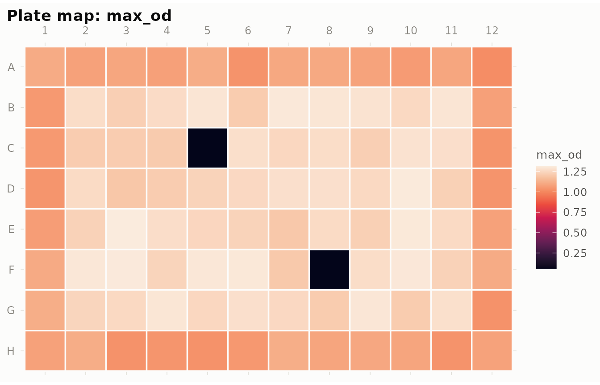
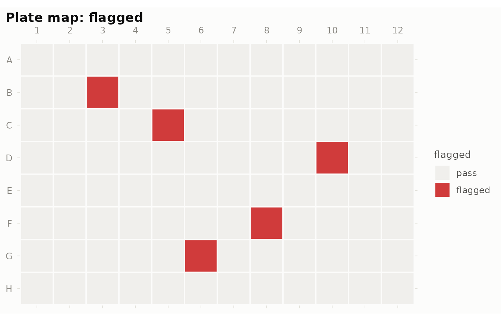
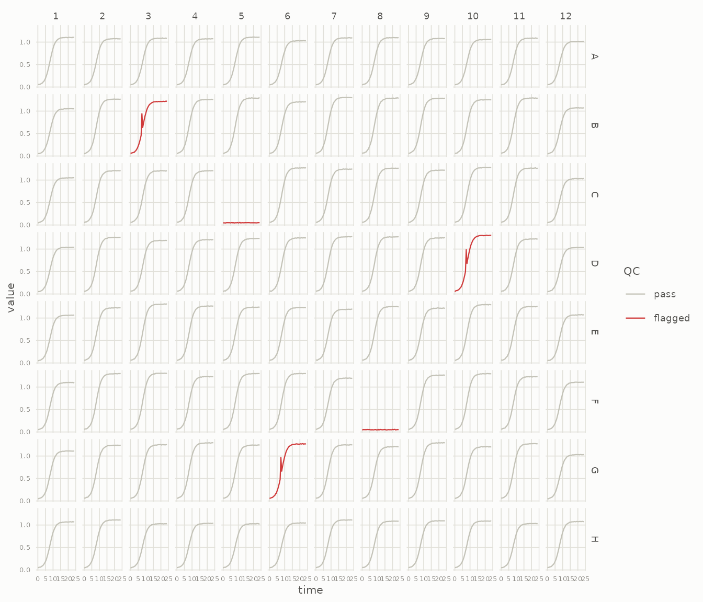
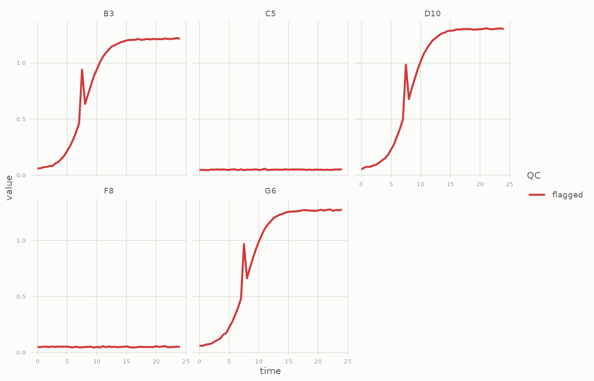
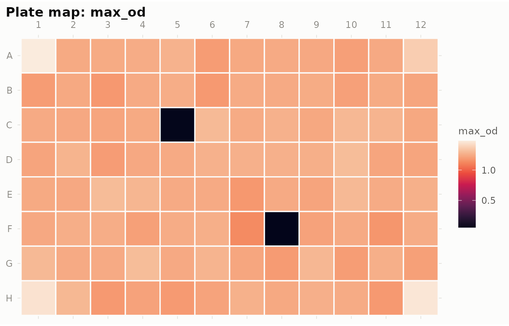
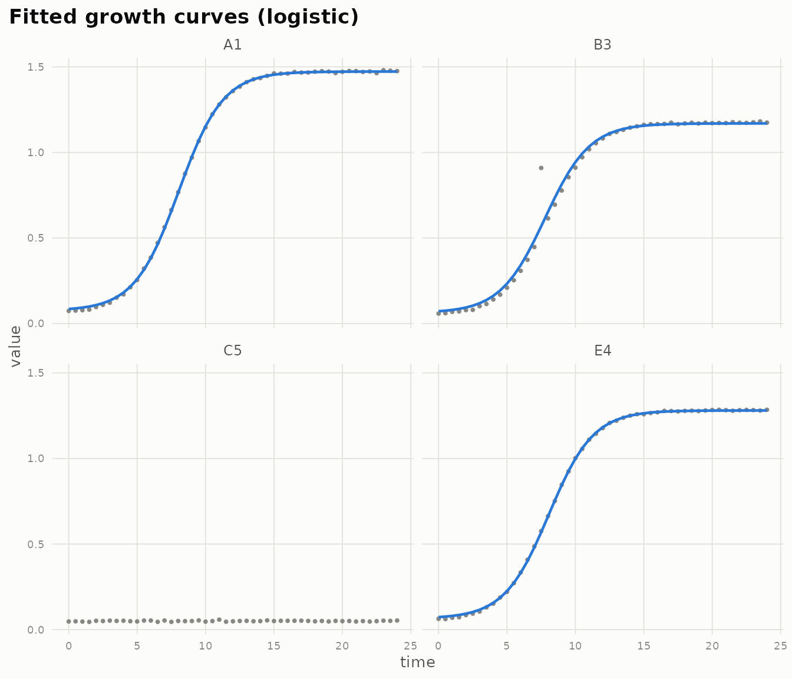
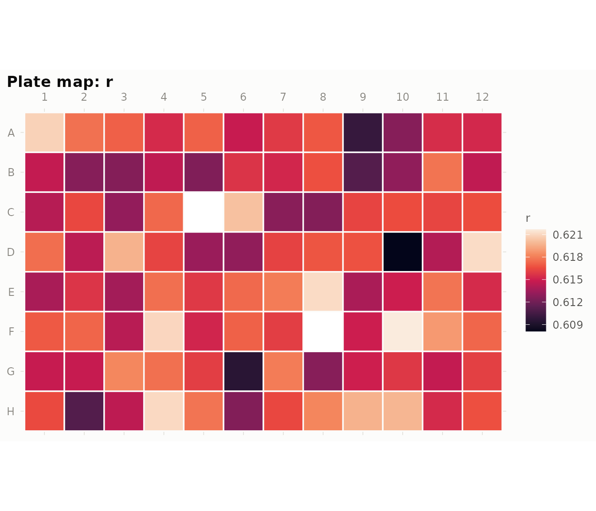
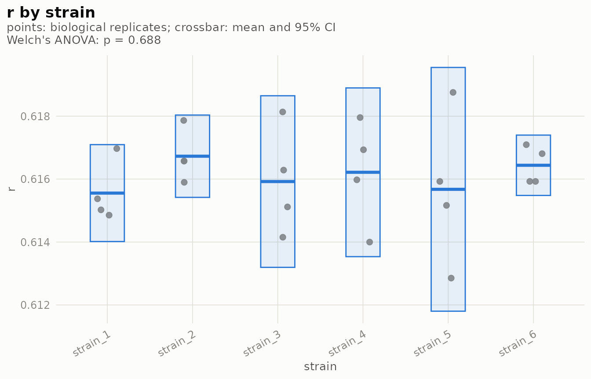

# gRate: from raw plate export to growth rates

gRate takes you from a raw 96-well plate reader export to growth
parameters you can trust. It reads the export, maps the plate layout,
flags problematic wells, corrects spatial artifacts, fits growth models
(parametric logistic or nonparametric “easylinear”), and summarises
parameters across replicates. Prefer growthcurver or gcplyr for the
fitting?
[`gr_export()`](https://loukesio.github.io/gRate/reference/gr_export.md)
hands them clean, QC’d data instead.

The whole pipeline is six verbs on one object:

``` r

gr_read("run1.csv") |>
  gr_layout("layout.csv") |>
  gr_qc() |>
  gr_spatial() |>
  gr_fit() |>
  gr_fit_summary()
```

This vignette walks through each step using the example data bundled
with the package: a synthetic 24-hour OD600 run with realistic problems
baked in — two dead wells, three wells with single-read spikes, and a
multiplicative edge effect.

``` r

library(gRate)
```

## 1. Read

[`gr_read()`](https://loukesio.github.io/gRate/reference/gr_read.md)
accepts the two generic layouts plate reader software exports: **wide**
(a time column plus one column per well) and **long** (well / time /
value columns). The layout is auto-detected; well names like `A01` are
normalised to `A1`, and `HH:MM:SS` times are converted to hours.

``` r

raw <- system.file("extdata", "growth_wide.csv", package = "gRate")
plate <- gr_read(raw)
plate
#> <gr_plate> 96 wells x 49 timepoints
#>   time: 0 to 24 (interval 0.5)
#>   instrument: generic, plate: growth_wide
#>   QC: not run (use gr_qc())
```

Native instrument exports are parsed directly — no reshaping in Excel
first.
[`gr_read()`](https://loukesio.github.io/gRate/reference/gr_read.md)
recognises BioTek Gen5 kinetic exports (metadata header, per-read
blocks, day-fraction times) and Tecan i-control kinetic exports
(transposed layout, `Time [s]` rows), both validated against real files.
Multi-read files name their reads; pick one with `read =`:

``` r

gr_read(system.file("extdata", "biotek_gen5.csv", package = "gRate"))
#> <gr_plate> 96 wells x 49 timepoints
#>   time: 0 to 24 (interval 0.5)
#>   instrument: BioTek Gen5, plate: biotek_gen5
#>   QC: not run (use gr_qc())
gr_read(system.file("extdata", "tecan_icontrol.csv", package = "gRate"))
#> <gr_plate> 96 wells x 49 timepoints
#>   time: 0 to 24 (interval 0.5)
#>   instrument: Tecan i-control, plate: tecan_icontrol
#>   QC: not run (use gr_qc())
```

Everything lives in a single `gr_plate` object: `$data` (tidy tibble),
`$qc` (per-well flags, once QC has run), and `$meta`.

``` r

head(plate$data)
#> # A tibble: 6 × 5
#>   well  row     col  time  value
#>   <chr> <chr> <int> <dbl>  <dbl>
#> 1 A1    A         1   0   0.0551
#> 2 A1    A         1   0.5 0.0566
#> 3 A1    A         1   1   0.0583
#> 4 A1    A         1   1.5 0.0608
#> 5 A1    A         1   2   0.0721
#> 6 A1    A         1   2.5 0.0818
```

## 2. Layout

[`gr_layout()`](https://loukesio.github.io/gRate/reference/gr_layout.md)
joins your experimental design onto the wells. The recommended format is
a long table with a `well` column plus any metadata columns; an 8 × 12
grid mirroring the physical plate also works for one variable at a time.

``` r

layout <- system.file("extdata", "layout_long.csv", package = "gRate")
plate <- gr_layout(plate, layout)
head(plate$data)
#> # A tibble: 6 × 9
#>   well  row     col  time  value strain   medium bio_rep tech_rep
#>   <chr> <chr> <int> <dbl>  <dbl> <chr>    <chr>    <int>    <int>
#> 1 A1    A         1   0   0.0551 strain_1 LB           1        1
#> 2 A1    A         1   0.5 0.0566 strain_1 LB           1        1
#> 3 A1    A         1   1   0.0583 strain_1 LB           1        1
#> 4 A1    A         1   1.5 0.0608 strain_1 LB           1        1
#> 5 A1    A         1   2   0.0721 strain_1 LB           1        1
#> 6 A1    A         1   2.5 0.0818 strain_1 LB           1        1
```

### Biological and technical replicates

Two metadata columns are treated specially: `bio_rep` (independent
cultures) and `tech_rep` (the same culture in several wells). Columns
already named that way — as in the example layout — are picked up
automatically; otherwise point the `bio_rep` / `tech_rep` arguments at
your own column names:

``` r

gr_layout(plate, "layout.csv", bio_rep = "biol_replicate", tech_rep = "tech")
```

Once designated, the replicate structure shows up in the print summary
and technical replicates can be averaged at export time (below).

``` r

plate
#> <gr_plate> 96 wells x 49 timepoints
#>   time: 0 to 24 (interval 0.5)
#>   instrument: generic, plate: growth_wide
#>   metadata: strain, medium, bio_rep, tech_rep 
#>   replicates: 4 biological x 2 technical
#>   QC: not run (use gr_qc())
```

## 3. Quality control

[`gr_qc()`](https://loukesio.github.io/gRate/reference/gr_qc.md) flags
wells that would corrupt downstream fits: `no_growth`, `spike`, `drift`,
`late_jump`, and `noisy`. Every threshold is an argument with a sensible
default. Flags never delete data — you decide later what to drop.

``` r

plate <- gr_qc(plate)
plate
#> <gr_plate> 96 wells x 49 timepoints
#>   time: 0 to 24 (interval 0.5)
#>   instrument: generic, plate: growth_wide
#>   metadata: strain, medium, bio_rep, tech_rep 
#>   replicates: 4 biological x 2 technical
#>   QC: 5 flagged wells (no_growth: 2, spike: 3)
subset(plate$qc, flagged)
#> # A tibble: 5 × 10
#>   well  row     col no_growth spike drift late_jump noisy flagged reasons  
#>   <chr> <chr> <int> <lgl>     <lgl> <lgl> <lgl>     <lgl> <lgl>   <chr>    
#> 1 B3    B         3 FALSE     TRUE  FALSE FALSE     FALSE TRUE    spike    
#> 2 C5    C         5 TRUE      FALSE FALSE FALSE     FALSE TRUE    no_growth
#> 3 D10   D        10 FALSE     TRUE  FALSE FALSE     FALSE TRUE    spike    
#> 4 F8    F         8 TRUE      FALSE FALSE FALSE     FALSE TRUE    no_growth
#> 5 G6    G         6 FALSE     TRUE  FALSE FALSE     FALSE TRUE    spike
```

The two plotting functions make the QC results easy to eyeball. The
plate heatmap shows any statistic or flag in its physical position:

``` r

gr_plot_plate(plate, "max_od")
```



``` r

gr_plot_plate(plate, "flagged")
```



Notice the dimmer outer ring in the `max_od` map — that is the edge
effect we will deal with next. The curve view highlights flagged wells
in orange:

``` r

gr_plot_curves(plate)
```



Zoom in on the flagged wells to see why they were caught:

``` r

gr_plot_curves(plate, wells = subset(plate$qc, flagged)$well)
```



## 4. Spatial correction (experimental)

Edge wells often read lower — evaporation and temperature gradients are
the usual suspects.
[`gr_spatial()`](https://loukesio.github.io/gRate/reference/gr_spatial.md)
estimates row and column effects on a per-well summary statistic (max OD
by default) using Tukey’s median polish, then divides each curve by its
estimated bias factor. Flagged wells are excluded from the estimation
but still receive the correction.

``` r

plate <- gr_spatial(plate)
round(plate$spatial$row_effects, 3)
#>     A     B     C     D     E     F     G     H 
#> 0.875 1.032 0.989 0.996 1.004 1.043 1.007 0.869
round(plate$spatial$col_effects, 3)
#>     1     2     3     4     5     6     7     8     9    10    11    12 
#> 0.856 0.992 1.003 0.984 1.000 0.992 1.013 1.012 1.000 1.005 1.007 0.850
```

Rows A and H and columns 1 and 12 sit well below 1 — the edge effect —
while the interior is essentially unbiased. After correction the plate
map is flat:

``` r

gr_plot_plate(plate, "max_od")
```



Treat this step as a diagnostic aid: median polish captures row/column
trends (corner wells are corrected twice over), and no correction
rescues a design that confounds treatment with plate position. Randomise
your layouts. The uncorrected values remain in `plate$data$value_raw`,
and `correct = FALSE` estimates the effects without touching the data.

## 5. Fit growth models

[`gr_fit()`](https://loukesio.github.io/gRate/reference/gr_fit.md)
estimates growth parameters per well, QC-aware and on the spatially
corrected values:

- `method = "logistic"` (default) — parametric `nls` fit of the logistic
  model: growth rate `r`, carrying capacity `K`, initial density `N0`,
  tangent lag time, doubling time.
- `method = "gompertz"` — parametric Gompertz fit, for curves with a
  long deceleration phase. Its rate constant lives on a different scale
  from the logistic `r`, so compare strains within one method.
- `method = "compare"` — fits logistic **and** Gompertz to every well
  and keeps the lower-AIC model, reporting the winner (`model`), both
  AICs, and the margin (`delta_aic`). Honest model selection: a small
  `delta_aic` means the data cannot really tell the models apart.
- `method = "easylinear"` — nonparametric, after Hall et al. (2014):
  rolling regressions on log OD; the steepest window passing an R²
  filter gives the maximum per-capita growth rate. Use it when curves
  are not logistic.

Wells that cannot be fitted (the dead wells here) get `fit_ok = FALSE`
and a `note` — never an error, and never silently dropped.

Want uncertainty on the estimates? `boot = 200` resamples the residuals
and refits per well, adding percentile confidence intervals
(`r_lo`/`r_hi`, and `K_lo`/`K_hi` for the logistic method) to the fit
table and to
[`gr_results()`](https://loukesio.github.io/gRate/reference/gr_results.md).
It takes a minute for a full plate, so it is off by default:

``` r

plate <- gr_fit(plate, boot = 200)
gr_results(plate, params = c("r", "K"))  # now includes r_lo, r_hi, K_lo, K_hi
```

``` r

plate <- gr_fit(plate)
plate
#> <gr_plate> 96 wells x 49 timepoints
#>   time: 0 to 24 (interval 0.5)
#>   instrument: generic, plate: growth_wide
#>   metadata: strain, medium, bio_rep, tech_rep 
#>   replicates: 4 biological x 2 technical
#>   QC: 5 flagged wells (no_growth: 2, spike: 3)
#>   spatial: corrected (stat: max_od)
#>   fit: logistic (94/96 wells), median r = 0.616
head(plate$fit)
#> # A tibble: 6 × 17
#>   well  row     col model     r     K      N0   lag t_rmax doubling_time   sigma
#>   <chr> <chr> <int> <chr> <dbl> <dbl>   <dbl> <dbl>  <dbl>         <dbl>   <dbl>
#> 1 A1    A         1 logi… 0.621  1.40 0.00941  4.82   8.04          1.12 0.00683
#> 2 A2    A         2 logi… 0.618  1.17 0.00809  4.81   8.05          1.12 0.00552
#> 3 A3    A         3 logi… 0.617  1.17 0.00811  4.81   8.05          1.12 0.00545
#> 4 A4    A         4 logi… 0.615  1.18 0.00837  4.79   8.04          1.13 0.00477
#> 5 A5    A         5 logi… 0.617  1.21 0.00830  4.82   8.06          1.12 0.00556
#> 6 A6    A         6 logi… 0.615  1.13 0.00794  4.79   8.05          1.13 0.00523
#> # ℹ 6 more variables: r_lo <dbl>, r_hi <dbl>, K_lo <dbl>, K_hi <dbl>,
#> #   fit_ok <lgl>, note <chr>
```

Overlay the fits on the data to judge them by eye, and map any parameter
back onto the plate:

``` r

gr_plot_fit(plate, wells = c("A1", "B3", "C5", "E4"))
```



``` r

gr_plot_plate(plate, "r")
```



### Multi-phase growth (diauxie)

[`gr_diauxie()`](https://loukesio.github.io/gRate/reference/gr_diauxie.md)
scans every well for multiple growth phases — the diauxic shift when a
culture switches carbon sources. Distinct phases appear as separate
peaks in the rolling per-capita growth rate profile with a genuine
trough between them; each phase gets its own rate and time.

``` r

dx <- gr_diauxie(plate)
table(dx$diauxic, useNA = "ifany")
#> 
#> FALSE  <NA> 
#>    94     2
```

(No diauxie in this example data — single logistic curves, as detected.)

### Lag time, honestly

Lag is the most method-dependent growth parameter there is.
[`gr_lag()`](https://loukesio.github.io/gRate/reference/gr_lag.md)
computes it four ways per well — logistic tangent, Gompertz tangent,
easylinear tangent, and a simple threshold crossing — and reports how
much they agree. A well where the definitions disagree wildly usually
has a curve shape that violates somebody’s assumptions; look at it
before quoting a lag.

``` r

lags <- gr_lag(plate)
head(lags[c("well", "lag_logistic", "lag_gompertz", "lag_easylinear",
            "lag_threshold", "lag_sd", "agree")])
#> # A tibble: 6 × 7
#>   well  lag_logistic lag_gompertz lag_easylinear lag_threshold lag_sd agree
#>   <chr>        <dbl>        <dbl>          <dbl>         <dbl>  <dbl> <lgl>
#> 1 A1            4.82         4.60           4.00           3.5  0.598 TRUE 
#> 2 A2            4.81         4.59           4.00           3.5  0.591 TRUE 
#> 3 A3            4.81         4.59           4.01           3.5  0.590 TRUE 
#> 4 A4            4.79         4.57           4.00           3.5  0.580 TRUE 
#> 5 A5            4.82         4.59           4.00           3.5  0.594 TRUE 
#> 6 A6            4.79         4.57           4.01           3.5  0.582 TRUE
```

### The results table

[`gr_results()`](https://loukesio.github.io/gRate/reference/gr_results.md)
is the table to carry into your analysis: one row per well, with your
metadata, the parameters you care about, and the QC verdict side by
side. Pick parameters with `params`, drop flagged wells if you want only
clean fits, or write it straight to CSV with `file`.

``` r

gr_results(plate)
#> # A tibble: 96 × 15
#>    well  row     col strain   medium bio_rep tech_rep     r     K   lag
#>    <chr> <chr> <int> <chr>    <chr>    <int>    <int> <dbl> <dbl> <dbl>
#>  1 A1    A         1 strain_1 LB           1        1 0.621  1.40  4.82
#>  2 A2    A         2 strain_1 LB           1        2 0.618  1.17  4.81
#>  3 A3    A         3 strain_2 LB           1        1 0.617  1.17  4.81
#>  4 A4    A         4 strain_2 LB           1        2 0.615  1.18  4.79
#>  5 A5    A         5 strain_3 LB           1        1 0.617  1.21  4.82
#>  6 A6    A         6 strain_3 LB           1        2 0.615  1.13  4.79
#>  7 A7    A         7 strain_4 LB           1        1 0.616  1.17  4.80
#>  8 A8    A         8 strain_4 LB           1        2 0.617  1.18  4.81
#>  9 A9    A         9 strain_5 LB           1        1 0.610  1.18  4.77
#> 10 A10   A        10 strain_5 LB           1        2 0.613  1.14  4.78
#> # ℹ 86 more rows
#> # ℹ 5 more variables: doubling_time <dbl>, fit_ok <lgl>, note <chr>,
#> #   flagged <lgl>, reasons <chr>
gr_results(plate, params = c("r", "K"), drop_flagged = TRUE)
#> # A tibble: 91 × 11
#>    well  row     col strain   medium bio_rep tech_rep     r     K fit_ok note 
#>    <chr> <chr> <int> <chr>    <chr>    <int>    <int> <dbl> <dbl> <lgl>  <chr>
#>  1 A1    A         1 strain_1 LB           1        1 0.621  1.40 TRUE   ""   
#>  2 A2    A         2 strain_1 LB           1        2 0.618  1.17 TRUE   ""   
#>  3 A3    A         3 strain_2 LB           1        1 0.617  1.17 TRUE   ""   
#>  4 A4    A         4 strain_2 LB           1        2 0.615  1.18 TRUE   ""   
#>  5 A5    A         5 strain_3 LB           1        1 0.617  1.21 TRUE   ""   
#>  6 A6    A         6 strain_3 LB           1        2 0.615  1.13 TRUE   ""   
#>  7 A7    A         7 strain_4 LB           1        1 0.616  1.17 TRUE   ""   
#>  8 A8    A         8 strain_4 LB           1        2 0.617  1.18 TRUE   ""   
#>  9 A9    A         9 strain_5 LB           1        1 0.610  1.18 TRUE   ""   
#> 10 A10   A        10 strain_5 LB           1        2 0.613  1.14 TRUE   ""   
#> # ℹ 81 more rows
```

``` r

gr_results(plate, file = "run1_growth_parameters.csv")
```

### Summarise across replicates

[`gr_fit_summary()`](https://loukesio.github.io/gRate/reference/gr_fit_summary.md)
is the step most fitting tools leave to you: it averages parameters over
technical and biological replicates *after* excluding flagged wells and
failed fits. By default it groups by every metadata column except the
replicate identifiers; pass `by` to group differently.

``` r

gr_fit_summary(plate)
#> # A tibble: 12 × 11
#>    strain   medium n_wells r_mean    r_sd K_mean   K_sd lag_mean  lag_sd
#>    <chr>    <chr>    <int>  <dbl>   <dbl>  <dbl>  <dbl>    <dbl>   <dbl>
#>  1 strain_1 LB           8  0.616 0.00258   1.20 0.0837     4.80 0.0241 
#>  2 strain_1 M9           8  0.615 0.00203   1.21 0.0659     4.80 0.0163 
#>  3 strain_2 LB           7  0.616 0.00215   1.16 0.0194     4.80 0.0155 
#>  4 strain_2 M9           8  0.617 0.00292   1.18 0.0457     4.81 0.0179 
#>  5 strain_3 LB           7  0.615 0.00273   1.18 0.0422     4.80 0.0159 
#>  6 strain_3 M9           7  0.616 0.00177   1.17 0.0243     4.80 0.00631
#>  7 strain_4 LB           8  0.615 0.00176   1.18 0.0119     4.80 0.0144 
#>  8 strain_4 M9           7  0.617 0.00257   1.14 0.0431     4.81 0.0154 
#>  9 strain_5 LB           7  0.614 0.00279   1.18 0.0268     4.78 0.0233 
#> 10 strain_5 M9           8  0.617 0.00296   1.18 0.0336     4.81 0.0219 
#> 11 strain_6 LB           8  0.616 0.00224   1.18 0.0460     4.81 0.0171 
#> 12 strain_6 M9           8  0.616 0.00141   1.19 0.0861     4.81 0.0148 
#> # ℹ 2 more variables: doubling_time_mean <dbl>, doubling_time_sd <dbl>
gr_fit_summary(plate, by = c("strain", "medium", "bio_rep"))
#> # A tibble: 48 × 12
#>    strain   medium bio_rep n_wells r_mean       r_sd K_mean     K_sd lag_mean
#>    <chr>    <chr>    <int>   <int>  <dbl>      <dbl>  <dbl>    <dbl>    <dbl>
#>  1 strain_1 LB           1       2  0.619  0.00226     1.28  0.159       4.81
#>  2 strain_1 LB           2       2  0.614  0.00137     1.15  0.0344      4.78
#>  3 strain_1 LB           3       2  0.615  0.00157     1.17  0.00844     4.79
#>  4 strain_1 LB           4       2  0.616  0.00222     1.18  0.0397      4.81
#>  5 strain_1 M9           1       2  0.615  0.00133     1.17  0.00420     4.80
#>  6 strain_1 M9           2       2  0.617  0.000230    1.18  0.0141      4.81
#>  7 strain_1 M9           3       2  0.615  0.0000216   1.20  0.0393      4.80
#>  8 strain_1 M9           4       2  0.614  0.00387     1.30  0.0942      4.79
#>  9 strain_2 LB           1       2  0.616  0.00127     1.18  0.00665     4.80
#> 10 strain_2 LB           2       1  0.615 NA           1.18 NA           4.78
#> # ℹ 38 more rows
#> # ℹ 3 more variables: lag_sd <dbl>, doubling_time_mean <dbl>,
#> #   doubling_time_sd <dbl>
```

### Compare groups

[`gr_compare()`](https://loukesio.github.io/gRate/reference/gr_compare.md)
tests whether a parameter differs between strains or conditions — at the
right unit of replication. Technical replicates are averaged into their
biological replicate *before* any test, so wells never inflate the
sample size. Two groups get a Welch t-test, more get Welch’s ANOVA plus
Holm-adjusted pairwise comparisons (`method = "kruskal"` for the
nonparametric versions).

``` r

cmp <- gr_compare(plate, what = "r", by = "strain")
cmp
#> <gr_compare> r by strain (unit: biological replicates)
#>   Welch's ANOVA: statistic = 0.622, p = 0.688
#> 
#> # A tibble: 6 × 7
#>   group        n  mean       sd       se ci_lo ci_hi
#>   <chr>    <int> <dbl>    <dbl>    <dbl> <dbl> <dbl>
#> 1 strain_1     4 0.616 0.000968 0.000484 0.614 0.617
#> 2 strain_2     4 0.617 0.000822 0.000411 0.615 0.618
#> 3 strain_3     4 0.616 0.00171  0.000857 0.613 0.619
#> 4 strain_4     4 0.616 0.00168  0.000842 0.614 0.619
#> 5 strain_5     4 0.616 0.00243  0.00122  0.612 0.620
#> 6 strain_6     4 0.616 0.000603 0.000301 0.615 0.617
#> 
#>   0 of 15 pairwise comparisons significant at 0.05 (Holm-adjusted); see $pairwise
gr_plot_compare(cmp)
```



(The bundled example data were generated with the same growth rate for
every strain, so an honest test finds nothing — exactly as it should.)

## 6. Export

Prefer growthcurver or gcplyr as the fitting engine?
[`gr_export()`](https://loukesio.github.io/gRate/reference/gr_export.md)
returns plain data frames in the shape those tools expect.
`drop_flagged = TRUE` is the one place gRate removes data — explicitly,
at your request.

``` r

tidy <- gr_export(plate)
head(tidy)
#> # A tibble: 6 × 13
#>   well  row     col  time  value strain medium bio_rep tech_rep value_raw fitted
#>   <chr> <chr> <int> <dbl>  <dbl> <chr>  <chr>    <int>    <int>     <dbl>  <dbl>
#> 1 A1    A         1   0   0.0736 strai… LB           1        1    0.0551 0.0851
#> 2 A1    A         1   0.5 0.0756 strai… LB           1        1    0.0566 0.0885
#> 3 A1    A         1   1   0.0779 strai… LB           1        1    0.0583 0.0931
#> 4 A1    A         1   1.5 0.0812 strai… LB           1        1    0.0608 0.0993
#> 5 A1    A         1   2   0.0963 strai… LB           1        1    0.0721 0.108 
#> 6 A1    A         1   2.5 0.109  strai… LB           1        1    0.0818 0.119 
#> # ℹ 2 more variables: flagged <lgl>, reasons <chr>

gc_input <- as_growthcurver(plate, drop_flagged = TRUE)
gc_input[1:3, 1:5]
#>   time         A1         A2         A3         A4
#> 1  0.0 0.07357964 0.05954082 0.05994136 0.05596081
#> 2  0.5 0.07558271 0.05965598 0.06165071 0.06234638
#> 3  1.0 0.07785287 0.07117258 0.06563921 0.06246249
```

The wide `gc_input` goes straight into growthcurver:

``` r

fits <- growthcurver::SummarizeGrowthByPlate(gc_input)
head(fits)
#>   sample        k          n0         r    t_mid    t_gen    auc_l    auc_e
#> 1     A1 1.399199 0.009626434 0.6186575 8.037142 1.120405 22.31972 22.28238
#> 2     A2 1.176944 0.008506315 0.6128762 8.031987 1.130974 18.77963 18.75464
#> 3     A3 1.177283 0.008370350 0.6141434 8.042313 1.128641 18.77314 18.74734
#> 4     A4 1.188690 0.008839847 0.6101798 8.020380 1.135972 18.98039 18.96183
#> 5     A5 1.209920 0.008775195 0.6118531 8.039678 1.132865 19.29644 19.27303
#> 6     A6 1.127635 0.008140152 0.6123885 8.040360 1.131875 17.98341 17.95740
#>         sigma note
#> 1 0.006252850     
#> 2 0.004431350     
#> 3 0.004788188     
#> 4 0.003635328     
#> 5 0.004379034     
#> 6 0.004737243
```

For gcplyr,
[`as_gcplyr()`](https://loukesio.github.io/gRate/reference/as_gcplyr.md)
produces the long `Well` / `Time` / `Measurements` shape (metadata
columns included).

``` r

head(as_gcplyr(plate, drop_flagged = TRUE))
#>   Well Time Measurements   strain medium bio_rep tech_rep     fitted
#> 1   A1  0.0   0.07357964 strain_1     LB       1        1 0.08508294
#> 2   A1  0.5   0.07558271 strain_1     LB       1        1 0.08847685
#> 3   A1  1.0   0.07785287 strain_1     LB       1        1 0.09307935
#> 4   A1  1.5   0.08119133 strain_1     LB       1        1 0.09930785
#> 5   A1  2.0   0.09628116 strain_1     LB       1        1 0.10771316
#> 6   A1  2.5   0.10923438 strain_1     LB       1        1 0.11901319
```

### Averaging technical replicates

With `tech_rep` designated, `collapse_tech = TRUE` averages the wells of
each technical replicate group at every timepoint. Combined with
`drop_flagged = TRUE`, only clean wells enter the average; otherwise
`flagged` tells you when any contributing well was suspect.

``` r

pooled <- gr_export(plate, collapse_tech = TRUE, drop_flagged = TRUE)
head(pooled)
#> # A tibble: 6 × 7
#>   strain   medium bio_rep  time  value n_wells flagged
#>   <chr>    <chr>    <int> <dbl>  <dbl>   <int> <lgl>  
#> 1 strain_1 LB           1   0   0.0666       2 FALSE  
#> 2 strain_1 LB           1   0.5 0.0676       2 FALSE  
#> 3 strain_1 LB           1   1   0.0745       2 FALSE  
#> 4 strain_1 LB           1   1.5 0.0778       2 FALSE  
#> 5 strain_1 LB           1   2   0.0886       2 FALSE  
#> 6 strain_1 LB           1   2.5 0.101        2 FALSE
```

## One-call Quarto report

`gr_report(plate)` renders the bundled Quarto (`.qmd`) template into a
standalone, self-contained HTML report — plate maps, flagged wells with
reasons, thresholds used, curves, and spatial effects — for keeping
alongside the raw export. It needs the Quarto CLI (bundled with recent
RStudio).

``` r

gr_report(plate, file = "run1_qc.html")
```

With `interactive = TRUE` (requires the plotly and DT packages), the
plots become zoomable and hoverable — hover a curve to see which well it
is — and the per-well results table becomes searchable and sortable:

``` r

gr_report(plate, file = "run1_qc.html", interactive = TRUE)
```
