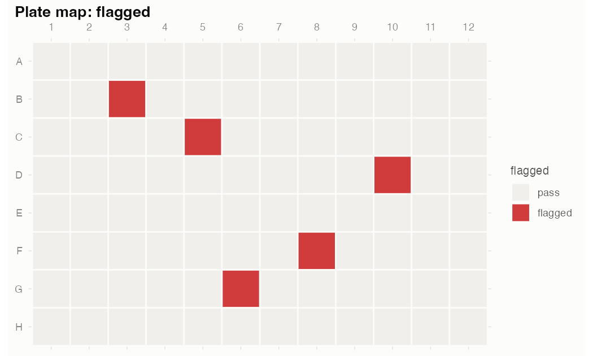

# gRate 

**From raw plate reader export to growth rates you can trust.**

gRate handles the whole journey for 96-well microbial growth curves: it
reads raw exports, maps plate layouts (including biological and
technical replicates), flags problematic wells, corrects positional
artifacts like edge effects, fits growth models (parametric logistic or
nonparametric “easylinear”), and summarises the parameters across
replicates. Prefer
[growthcurver](https://cran.r-project.org/package=growthcurver) or
[gcplyr](https://cran.r-project.org/package=gcplyr) as the fitting
engine?
[`gr_export()`](https://loukesio.github.io/gRate/reference/gr_export.md)
hands them clean, QC’d data instead.

## Why gRate?

Everyone hand-rolls this plumbing: eyeballing 96 curves for condensation
spikes, dead wells, and contamination — and pretending the outer ring
doesn’t read 15% low. gRate automates the boring, error-prone part with
two firm principles:

- **Flag, never delete.** Every QC decision is recorded per well with
  its reason; *you* choose what to drop, and only at export.
- **Every threshold is an argument.** Sensible defaults for OD600
  curves, nothing hard-coded.

## Installation

``` r

# install.packages("devtools")
devtools::install_github("loukesio/gRate")
```

## The pipeline

Six verbs on one object:

``` r

library(gRate)

gr_read("run1.csv") |>                 # generic, Gen5, or i-control export
  gr_layout("layout.csv") |>           # strain/medium + bio/tech replicates
  gr_qc() |>                           # flag bad wells (never delete)
  gr_spatial() |>                      # correct edge effects (experimental)
  gr_fit() |>                          # logistic or easylinear growth fits
  gr_fit_summary()                     # r, K, lag +- SD across replicates
```

Every function takes and returns a single `gr_plate` object (`$data`,
`$qc`, `$meta`), so steps can be reordered, skipped, or inspected at any
point:

    <gr_plate> 96 wells x 49 timepoints
      time: 0 to 24 (interval 0.5)
      metadata: strain, medium, bio_rep, tech_rep
      replicates: 4 biological x 2 technical
      QC: 5 flagged wells (no_growth: 2, spike: 3)
      spatial: corrected (stat: max_od)
      fit: logistic (94/96 wells), median r = 0.615

## See your plate

All plots are ggplot2 objects — restyle, retheme, or `ggsave()` them
like any other. The plate map makes spatial trouble obvious at a glance
(note the dim outer ring and the two dead wells):

``` r

gr_plot_plate(plate, "max_od")
```


And every curve in its physical position, flagged wells highlighted:

``` r

gr_plot_curves(plate)
```


## What gets flagged

| Flag        | Catches                                      |
|-------------|----------------------------------------------|
| `no_growth` | empty or dead wells                          |
| `spike`     | condensation, bubbles, single-read glitches  |
| `drift`     | linear baseline drift with no sigmoid shape  |
| `late_jump` | contamination-like sudden late rise          |
| `noisy`     | erratic reads (robust loess residual spread) |

``` r

gr_plot_plate(plate, "flagged")
subset(plate$qc, flagged)
#>   well  reasons
#>   B3    spike
#>   C5    no_growth
#>   ...
```


## Replicates

[`gr_layout()`](https://loukesio.github.io/gRate/reference/gr_layout.md)
understands **biological** (`bio_rep`) and **technical** (`tech_rep`)
replicates — either name the columns that way in your layout, or
designate any column:

``` r

gr_layout(plate, "layout.csv", bio_rep = "culture", tech_rep = "tech_well")
```

Technical replicates can be averaged at export, optionally after
dropping flagged wells so only clean curves enter the mean:

``` r

gr_export(plate, collapse_tech = TRUE, drop_flagged = TRUE)
```

## Estimate growth rates

[`gr_fit()`](https://loukesio.github.io/gRate/reference/gr_fit.md) fits
every well — QC-aware, on spatially corrected values — with your choice
of engine: parametric **logistic** or **Gompertz** models (`nls`)
returning growth rate `r`, carrying capacity `K`, lag and doubling time;
the nonparametric **easylinear** method (Hall et al. 2014) — rolling
regressions on log OD whose steepest R²-filtered window gives the
maximum per-capita growth rate; or `method = "compare"`, which fits
logistic and Gompertz to every well and keeps the lower-AIC model with
its margin (`delta_aic`) — honest model selection in a tidy output.
Wells that cannot be fitted get `fit_ok = FALSE` and a note, never an
error. Add `boot = 200` for bootstrap confidence intervals on `r` (and
`K`) per well.


[`gr_diauxie()`](https://loukesio.github.io/gRate/reference/gr_diauxie.md)
detects multi-phase (diauxic) growth automatically: separate peaks in
the rolling per-capita rate profile, with per-phase rates, shift time,
and honest `NA`s where nothing can be estimated.


[`gr_lag()`](https://loukesio.github.io/gRate/reference/gr_lag.md)
treats lag time with the honesty it needs: it computes four definitions
per well (logistic/Gompertz/easylinear tangents, threshold crossing) and
reports their agreement — disagreement is itself a diagnostic.


[`gr_results()`](https://loukesio.github.io/gRate/reference/gr_results.md)
gives you *the* table to carry into your analysis — one row per well
with your metadata, the parameters you care about, and the QC verdict
side by side (or straight to CSV with `file = "..."`):

``` r

gr_results(plate, params = c("r", "K", "lag"), drop_flagged = TRUE)
#>   well  strain   medium bio_rep tech_rep     r     K   lag fit_ok
#>   A1    strain_1 LB           1        1 0.615  1.10  4.78 TRUE
#>   A2    strain_1 LB           1        2 0.618  1.12  4.81 TRUE
#>   ...
```

[`gr_fit_summary()`](https://loukesio.github.io/gRate/reference/gr_fit_summary.md)
then does the step most fitting tools leave to you: averaging parameters
over technical and biological replicates *after* excluding flagged wells
and failed fits:

``` r

gr_fit_summary(plate)
#>   strain   medium n_wells r_mean  r_sd K_mean  K_sd ...
#>   strain_1 LB           8  0.62  0.011   1.19 0.028
#>   strain_2 LB           7  0.61  0.013   1.18 0.031
```

## Compare strains or conditions

[`gr_compare()`](https://loukesio.github.io/gRate/reference/gr_compare.md)
tests whether r (or K, lag, …) differs between groups — at the right
unit of replication. Technical replicates are averaged into their
biological replicate *before* any test, so wells never inflate the
sample size (the pseudoreplication trap). Welch t-test / ANOVA with
Holm-adjusted pairwise comparisons, or Kruskal-Wallis;
[`gr_plot_compare()`](https://loukesio.github.io/gRate/reference/gr_plot_compare.md)
draws replicate points with group means and CIs.

``` r

cmp <- gr_compare(plate, what = "r", by = "strain")
cmp
#> <gr_compare> r by strain (unit: biological replicates)
#>   Welch two-sample t-test: statistic = 38.3, p = 1.5e-16
#>   ...
gr_plot_compare(cmp)
```


## Edge-effect correction

[`gr_spatial()`](https://loukesio.github.io/gRate/reference/gr_spatial.md)
estimates row and column effects on max OD (or AUC) with Tukey’s median
polish and divides each curve by its bias factor. Flagged wells are
excluded from the estimation but still corrected; raw values are kept in
`value_raw`.


It is deliberately simple and clearly labeled **experimental** — median
polish captures row/column trends but corrects corner wells twice over
(you can see it in the corners above) — and no correction rescues a
design that confounds treatment with plate position. Randomise your
layouts.

## Prefer another fitting engine?

``` r

as_growthcurver(plate, drop_flagged = TRUE)   # wide: time + one column per well
as_gcplyr(plate)                              # long: Well / Time / Measurements
gr_export(plate)                              # tidy tibble with QC + metadata
```

## One-call Quarto report

``` r

gr_report(plate, file = "run1_qc.html")
```

renders a bundled Quarto (`.qmd`) template into a single self-contained
HTML file — plate maps, flagged wells with reasons, the thresholds used,
all curves, growth parameters, and spatial effects — for keeping
alongside the raw export. Needs the [Quarto CLI](https://quarto.org)
(bundled with recent RStudio). Add `interactive = TRUE` for zoomable,
hoverable plotly figures (hover a curve to see its well) and a
searchable per-well results table.

## Related packages

Several good R packages analyse microbial growth curves; they differ in
what they fit and in how much of the surrounding workflow they cover:

| Package | Approach | Scope |
|----|----|----|
| [growthcurver](https://cran.r-project.org/package=growthcurver) | Logistic `nls` fit per well | Fitting only; wide-format input, no QC or layout handling |
| [gcplyr](https://cran.r-project.org/package=gcplyr) | Tidy data wrangling + model-free per-capita derivatives | Flexible building blocks; you assemble the pipeline (incl. manual diauxie analysis) yourself |
| [growthrates](https://cran.r-project.org/package=growthrates) | Multiple parametric models + an easylinear implementation | Fitting engines; no QC, layout, or plate-level tooling |
| [ipolygrowth](https://cran.r-project.org/package=ipolygrowth) | Fourth-degree polynomial via OLS, parameters from derivatives | Avoids `nls` convergence issues; replicates organized in one table |
| [QurvE](https://cran.r-project.org/package=QurvE) | Multi-model growth/fluorescence analysis with a GUI | Broad scope incl. dose-response; GUI-centric workflow |

gRate’s focus is the parts these leave out: automated per-well **QC
flagging**, **spatial/edge-effect correction**, **replicate-aware
statistics** (pseudoreplication-safe comparisons, technical-replicate
averaging), honest **model selection** (AIC + bootstrap CIs), **diauxie
detection**, **multi-method lag agreement**, and a one-call **Quarto
report** — while
[`gr_export()`](https://loukesio.github.io/gRate/reference/gr_export.md)
/
[`as_growthcurver()`](https://loukesio.github.io/gRate/reference/as_growthcurver.md)
/
[`as_gcplyr()`](https://loukesio.github.io/gRate/reference/as_gcplyr.md)
hand clean data to any of the above if you prefer their fitting engines.
Convergence-robust rate estimation is covered by
`gr_fit(method = "easylinear")` (rolling OLS, no `nls`), with graceful
`fit_ok = FALSE` notes where parametric fits fail.

## Status & roadmap

- Generic wide/long CSV/TSV/Excel parsers, QC flags, ggplot2 plate/curve
  plots, replicate handling, median-polish spatial correction, logistic
  and easylinear growth fitting with replicate summaries, exporters, and
  the Quarto report: **done**, with `R CMD check` clean and a
  synthetic-plate test suite that recovers every injected artifact and
  the true growth parameters.
- Tecan i-control and BioTek Gen5 native parsers: **done** — written and
  validated against real instrument exports.
  [`gr_read()`](https://loukesio.github.io/gRate/reference/gr_read.md)
  auto-detects them, handles multi-read files (`read = "GFP"`), converts
  day-fraction and `Time [s]` timestamps to hours, and keeps the
  temperature in `$meta`. Found an export variant that doesn’t parse?
  [Open an issue](https://github.com/loukesio/gRate/issues) with the
  file.
- 384-well support: out of scope for now (the design leaves room for
  it).

See
[`vignette("gRate")`](https://loukesio.github.io/gRate/articles/gRate.md)
for the full walkthrough on the bundled example data.
